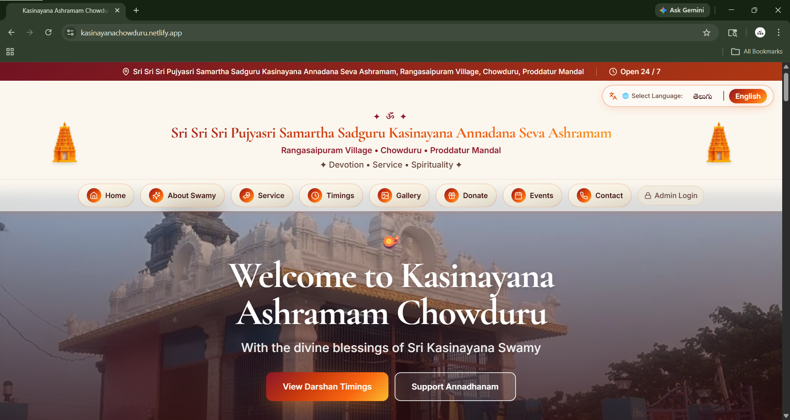

# 🪔 Kasinayana Ashramam Chowduru Website

A premium **freelance web development project** created for **Kasinayana Ashramam Chowduru**. This modern temple website was designed to help devotees access temple information, timings, services, events, donations, and updates through a professional digital experience.

---

## 🌸 Live Website

🔗 **[https://kasinayanachowduru.netlify.app/](https://kasinayanachowduru.netlify.app/)**
---

## 💼 Project Overview

* ✅ Freelance Client Project
* ✅ Custom Temple / Spiritual Organization Website
* ✅ Responsive Across Mobile, Tablet & Desktop
* ✅ SEO Friendly Structure
* ✅ Fast Performance Optimized UI

---

## ✨ Key Features

* 🛕 Elegant devotional custom interface
* 🌐 Telugu + English language support
* 📅 Temple timings & schedules
* 🍛 Annadhanam service information
* 🎉 Festivals & event announcements
* 🖼️ Gallery for temple photos
* 💝 Donation support section
* 🗺️ Integrated location map
* 🔐 Admin login/dashboard system
* 📱 Mobile responsive layout

---

## 🛠️ Tech Stack

```text id="cq6y8e"
Frontend: React + TypeScript
Build Tool: Vite
Styling: Tailwind CSS
Routing: React Router
Data Fetching: TanStack Query
Hosting: Netlify
```

---

## 📂 Project Structure

```text id="4obdd8"
src/
 ┣ components/
 ┃ ┣ sections/
 ┃ ┣ ui/
 ┃ ┗ common/
 ┣ pages/
 ┣ i18n/
 ┣ App.tsx
 ┗ main.tsx
```

---

## 🚀 Run Project Locally

```bash id="9h5d0v"
git clone https://github.com/supriyaalisetty001/repository-name.git
cd repository-name
npm install
npm run dev
```

---

## 📦 Production Build

```bash id="4sgdxg"
npm run build
```

---

## 🌍 Deployment

Successfully deployed on **Netlify** for secure and fast global access.

---

## 🎯 Project Purpose

This website was developed to establish a strong online presence for the temple and make temple services, announcements, and donations easily accessible to devotees worldwide.

---

## 🤝 Freelance Services Available

I also build custom websites for:

* Temple / Ashram Websites
* Business Websites
* Portfolios
* Booking Platforms
* Admin Panels
* Custom React Websites

---

## 📞 Contact

For freelance projects, collaborations, or custom website development inquiries, feel free to connect.

---

## 📜 License

This project was custom developed for client use.

---


